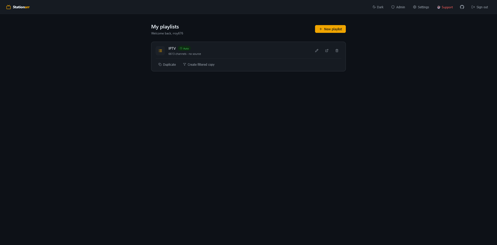
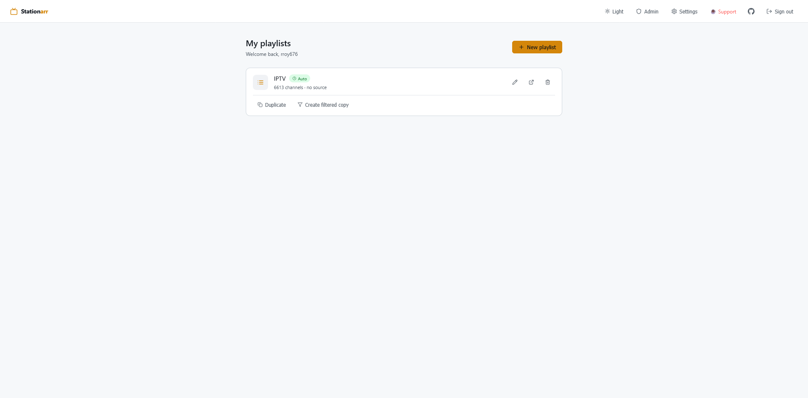
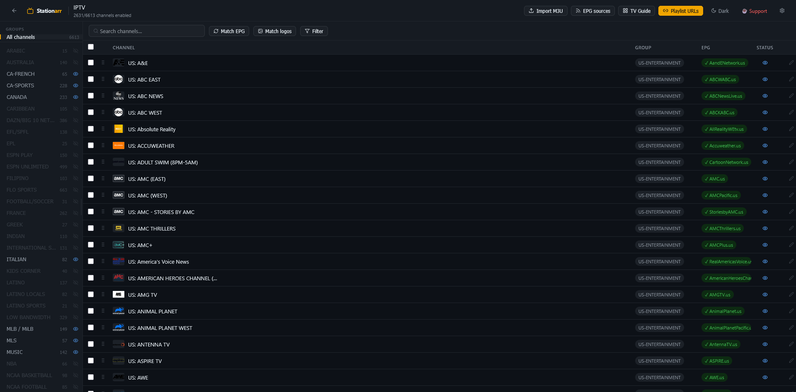
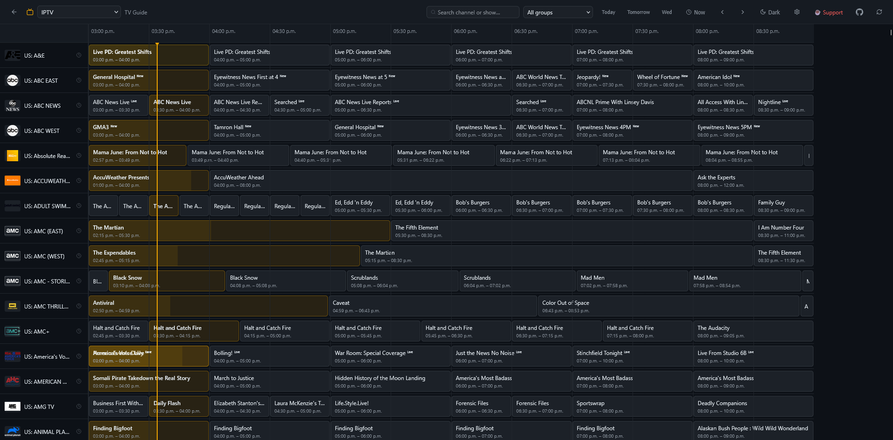
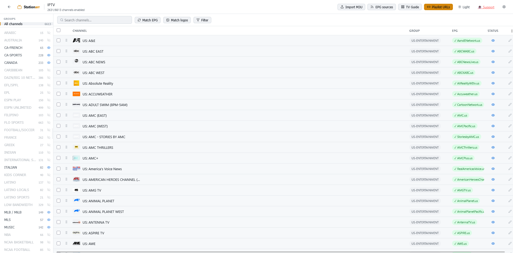

<p align="center">
  
</p>

<h1 align="center">
  <span style="color:#f0a500">Station</span>arr
</h1>

<p align="center">
  <strong>Self-hosted IPTV playlist and EPG manager</strong>
</p>

<p align="center">
  
  
  
  <a href="https://ko-fi.com/rroy676"></a>
</p>

---

A self-hosted, open-source IPTV playlist and EPG manager. Import your M3U playlist, organise channels, match programme guide data from multiple sources, and serve a clean edited playlist directly to your IPTV player.

---

## Screenshots

**Dashboard**
<p align="center">
  
  
</p>

**Channel Editor**
<p align="center">
  
  
</p>

**TV Guide**
<p align="center">
  
  
</p>

---

## Features

### Playlist management
- Import M3U via provider login (Xtream Codes), URL, or file upload
- Duplicate playlists or create filtered copies (by group, keyword, enabled channels)
- Auto-refresh channels on a schedule
- Xtream Codes API output — compatible with TiviMate, IPTV Smarters, etc.

### Channel editor
- Visual channel editor — rename, reorder (drag & drop), group
- Bulk operations — enable, disable, delete, reassign group
- Ctrl/Cmd+click and Shift+click multi-select
- Filter channels by enabled status or EPG mapping
- Virtual scrolling — handles 5000+ channel playlists smoothly
- Group sidebar with eye toggle (enable/disable all channels in a group at once)
- Draggable sidebar width

### EPG (Electronic Programme Guide)
- Multiple XMLTV sources with drag-to-reorder priority
- Auto-match channels to EPG by TVG ID — choose which source to match from
- Searchable EPG channel picker with source filter per channel
- Timeshift per channel (slider + manual input)
- EPG preview in channel panel (next 6 hours, now-playing progress bar)
- Memory-efficient SAX streaming parser — handles 100MB+ XMLTV files without RAM spikes
- Built-in free EPG source library (EPG.pw, i.mjh.nz, xmltv.net) for 30+ countries

### iptv-org/epg scraper integration
- Optional Docker sidecar to scrape EPG from 100+ websites
- Manage scraper channels from within Stationarr UI — no terminal needed
- Search the iptv-org channel database by country and name
- Run scraper on demand with live log output in browser
- Auto-fetch guide into Stationarr when scrape completes

### TV Guide
- Time grid with programme blocks and progressive loading
- Search by channel name or programme title
- Filter by group, switch playlists without leaving the guide
- Day navigation (Today, Tomorrow, day-of-week buttons)
- Date headers at midnight boundaries when scrolling to a new day
- Adjust timeshift per channel directly from the guide
- Timezone selector — applied to all time displays

### Logo management
- Auto-match logos from EPG sources
- Logo browser — searches [tv-logo/tv-logos](https://github.com/tv-logo/tv-logos) (10,000+ logos)
- Auto-saves logo when selected, updates channel list immediately

### Output
- Hosted M3U URL per playlist — use directly in any IPTV player
- Hosted EPG URL (merged XMLTV from all mapped sources with timeshift applied)
- Xtream Codes API (`player_api.php`, live stream redirect, `xmltv.php`)

### Multi-user
- JWT authentication — first registered account is automatically admin
- Admin panel — user management, stats, password reset
- Registration can be disabled after setup

### UI
- Dark mode, light mode, auto (follows system preference)
- Theme toggle in every page header
- Responsive layout

---

## Quick start — Docker (recommended)

```bash
git clone https://github.com/YOUR_USERNAME/Stationarr.git
cd Stationarr
cp .env.example .env          # set JWT_SECRET to a long random string
docker compose up -d
```

Open `http://localhost:3005` and register your account. The first account is automatically admin.

### With iptv-org/epg scraper (optional)

The EPG scraper lets you fetch programme data for specific channels from 100+ websites. It runs as a separate Docker container.

**Step 1 — Build the scraper image (one time):**
```bash
cd /tmp
git clone --depth 1 https://github.com/iptv-org/epg.git iptv-epg
cd iptv-epg
docker build -t iptv-org-epg:local .
cd /path/to/Stationarr
```

**Step 2 — Uncomment the `epg:` block in `docker-compose.yml`**

**Step 3 — Restart:**
```bash
docker compose up -d
```

**Step 4 — Go to Settings → EPG Scraper** to add channels and run the scraper from the UI.

---

## Quick start — Bare metal

### Requirements
- Node.js 20+
- npm 9+

```bash
git clone https://github.com/YOUR_USERNAME/Stationarr.git
cd Stationarr
cp .env.example .env

# Build frontend
cd frontend && npm install && npm run build && cd ..

# Install backend dependencies
cd backend && npm install --omit=dev && cd ..

# Run with PM2
npm install -g pm2
pm2 start ecosystem.config.js
pm2 save && pm2 startup
```

App will be available at `http://localhost:3000`.

### Nginx reverse proxy (optional)

Copy `nginx/stationarr.conf` to `/etc/nginx/sites-available/` and update `server_name`. Then:

```bash
sudo ln -s /etc/nginx/sites-available/stationarr.conf /etc/nginx/sites-enabled/
sudo nginx -t && sudo systemctl reload nginx
```

---

## Environment variables

| Variable | Default | Description |
|---|---|---|
| `PORT` | `3000` | Port the backend listens on |
| `JWT_SECRET` | *(required)* | Secret for signing JWT tokens — use a long random string |
| `JWT_EXPIRES_IN` | `7d` | Token expiry |
| `DATA_DIR` | `./data` | Directory for SQLite DB and EPG cache |
| `BASE_URL` | `http://localhost:3000` | Public base URL — used in hosted playlist links |
| `REGISTRATION_OPEN` | `true` | Set to `false` to disable new user signups after setup |
| `SCRAPER_URL` | `http://epg:3000` | URL of the iptv-org/epg sidecar container |
| `SCRAPER_CHANNELS_PATH` | `/app/data/scraper/channels.xml` | Path to channels.xml shared with scraper |

---

## Hosted playlist URLs

After importing a playlist, each user gets unique URLs:

| URL | Description |
|---|---|
| `http://yourhost/api/serve/{slug}/playlist.m3u` | Edited M3U playlist |
| `http://yourhost/api/serve/{slug}/epg.xml` | Merged EPG (XMLTV) |
| `http://yourhost/api/serve/{slug}/xtream` | Xtream Codes API base URL |

Add these directly to your IPTV player (TiviMate, IPTV Smarters, Kodi, VLC, etc.)

---

## Free EPG sources

Stationarr includes a built-in browser of free public EPG sources. Go to **EPG Sources → Browse library** to add them in one click.

| Source | Coverage | Notes |
|---|---|---|
| EPG.pw | 50+ countries | Broad coverage, recommended starting point |
| i.mjh.nz — PlutoTV | US, CA, UK, AU | Free streaming channels |
| i.mjh.nz — Plex | US, CA, UK, AU | Plex live TV channels |
| i.mjh.nz — Samsung TV+ | US, CA, UK, DE, FR, ES, IT | Samsung free channels |
| xmltv.net | US, Canada, UK | Community maintained |

---

## Compatible IPTV players

| Player | Platform | M3U | EPG | Xtream |
|---|---|---|---|---|
| TiviMate | Android / Fire TV | ✓ | ✓ | ✓ |
| IPTV Smarters Pro | iOS / Android | ✓ | ✓ | ✓ |
| Kodi (PVR IPTV) | All | ✓ | ✓ | — |
| VLC | All | ✓ | — | — |
| Infuse | iOS / macOS | ✓ | — | — |
| Channels DVR | All | ✓ | ✓ | — |

---

## Project structure

```
Stationarr/
├── backend/src/
│   ├── index.js              Express app entry
│   ├── db.js                 SQLite schema + migrations
│   ├── scheduler.js          Auto-refresh background jobs
│   ├── middleware/auth.js    JWT verification
│   ├── routes/
│   │   ├── auth.js           Register / login / me / password
│   │   ├── playlists.js      Playlist CRUD + import + clone
│   │   ├── channels.js       Channel CRUD + reorder + bulk ops
│   │   ├── epg.js            EPG source management + fetch + match
│   │   ├── guide.js          TV Guide API with in-memory caching
│   │   ├── scraper.js        iptv-org/epg scraper integration
│   │   ├── serve.js          Public hosted M3U + EPG + Xtream output
│   │   └── xtream.js         Xtream Codes API compatibility
│   └── utils/
│       ├── m3u.js            Parse + export M3U
│       ├── xmltv.js          SAX streaming XMLTV parser (memory efficient)
│       ├── xmltv-merge.js    Multi-source XMLTV merge with timeshift
│       └── epg-reader.js     On-demand programme extraction for guide
├── frontend/src/
│   ├── pages/
│   │   ├── Dashboard.jsx     Playlist list + clone/duplicate
│   │   ├── Editor.jsx        Channel editor
│   │   ├── Guide.jsx         TV Guide grid with progressive loading
│   │   ├── Settings.jsx      Timezone + theme + password
│   │   ├── Scraper.jsx       EPG scraper management UI
│   │   └── Admin.jsx         User management (admin only)
│   └── components/
│       ├── ChannelTable.jsx  Virtual-scrolling channel list
│       ├── ChannelPanel.jsx  Channel detail + EPG source picker
│       ├── EPGPanel.jsx      EPG source management + priority ordering
│       ├── GroupSidebar.jsx  Draggable group filter sidebar
│       ├── ImportModal.jsx   Import + clone playlist modal
│       ├── IPTVOrgBrowser.jsx Free EPG source library browser
│       ├── LogoBrowser.jsx   tv-logos logo search
│       └── ThemeToggle.jsx   Dark/light/auto theme switcher
├── epg/channels.xml          iptv-org/epg scraper channel config
├── nginx/stationarr.conf      Nginx reverse proxy config
├── docker-compose.yml
├── Dockerfile
└── ecosystem.config.js       PM2 config for bare-metal deployment
```

---

## Support the Project

Stationarr is free and open source, built and maintained in spare time. If it's useful to you, consider buying me a coffee — it helps cover server costs and keeps development going.

<p align="center">
  <a href="https://ko-fi.com/rroy676" target="_blank">
    
  </a>
</p>

---

## Contributing

PRs welcome! See [CONTRIBUTING.md](CONTRIBUTING.md) for details.

## License

MIT
